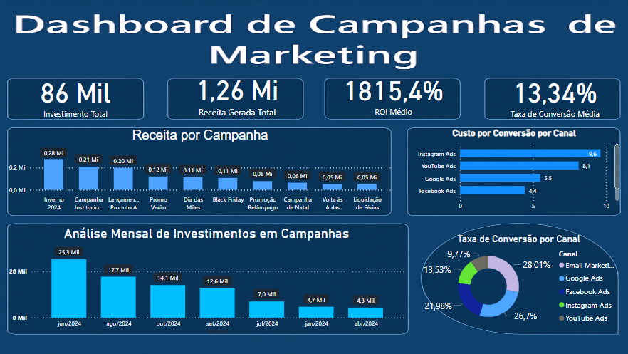

# 📊 Dashboard de Marketing - Power BI

Este projeto apresenta um **Dashboard de Marketing** desenvolvido no Power BI com o objetivo de analisar a performance de campanhas ao longo de 1 ano completo. A proposta simula um cenário real dentro de uma empresa da área de marketing, ideal para demonstrar minhas habilidades com análise de dados e visualização de KPIs estratégicos.

##  Objetivo do Projeto

Construir um dashboard profissional que forneça insights rápidos e visuais claros para tomada de decisão estratégica, com foco em:

- Acompanhamento de investimentos em campanhas
- Eficiência por canal de divulgação
- Retorno financeiro por campanha
- Conversão de cliques em vendas

##  Principais Gráficos do Dashboard

1. **Receita por Campanha**  
   Visualização clara da performance de cada campanha em termos de receita gerada.

2. **Custo por Conversão por Canal**  
   Métrica que indica o quanto foi gasto, em média, para cada conversão em cada canal de marketing.

3. **Análise Mensal de Investimento por Campanha**  
   Compara o valor investido mensalmente, destacando picos e períodos de baixa.

4. **Taxa de Conversão por Canal**  
   Mostra a eficiência de cada canal na conversão de cliques em ações efetivas.

##  Ferramentas e Tecnologias

- Power BI
- DAX (Data Analysis Expressions)
- Limpeza e modelagem de dados
- Design de dashboards com plano de fundo personalizado

## 📷 Screenshot do Dashboard

## 📁 Arquivo `.pbix`

Você pode acessar o projeto completo clicando no link abaixo:

🔗 [Repositório no GitHub](https://github.com/GabrielaSilva45/dashboard-vendas-powerbi)

## 🤝 Contribuição

Feedbacks e sugestões são super bem-vindos! Este projeto faz parte do meu portfólio de aprendizado na área de Análise de Dados.

